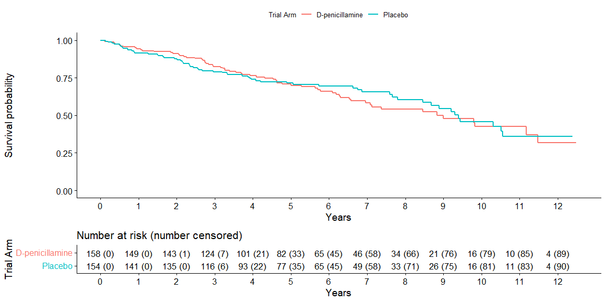
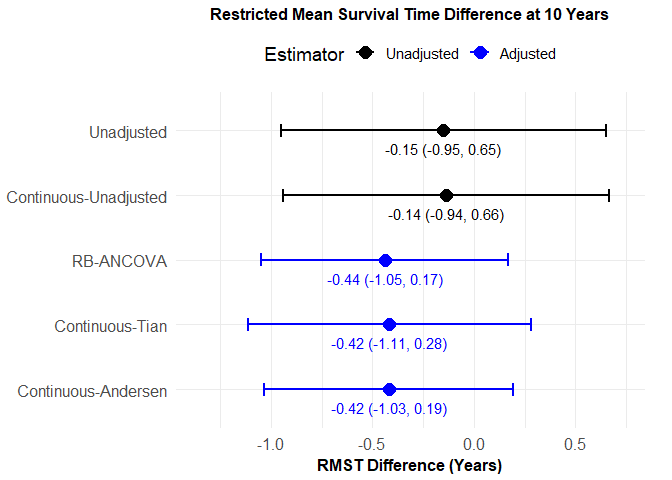
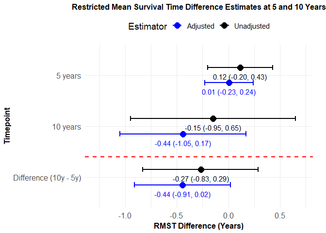

RBANCOVA.RMST: RBANCOVA for RMST estimates with Categorized
time-to-event data
================

# Overview

This vignette shows how to implement Randomoziation-Based Covariance
Analysis (RB_ANCOVA) for Restricted Mean Survival Time (RMST)
comparisons between treatments using RBANCOVA.RMST. We’ll demonstrate
via application to estimating the effect of D-Penicillamine for Primary
Biliary Cholangitis (PBC).

## APPLICATION: D-PENICILLAMINE FOR PRIMARY BILIARY CHOLANGITIS

Primary biliary cholangitis (PBC) is a chronic autoimmune disease
characterized by progressive inflammation and destruction of the small
bile ducts within the liver, ultimately leading to cirrhosis (permanent
scarring of liver tissues) and liver failure in advanced stages (May
Clinic 2024). The progression of PBC is inevitable, but it can be
prolonged with treatment. Due to its clinical importance and the need
for effective therapeutic options, PBC has been a focus of clinical
trials for several decades. A dataset often used to study the natural
history and treatment response in PBC patients originates from a Mayo
Clinic trial conducted between 1974 and 1984.

The dataset includes 424 patients diagnosed with PBC who were referred
to the Mayo Clinic between 1974 and 1984 (Therneau 2024, Therneau &
Grambsch 2000). Of these, 312 patients were enrolled in a randomized,
placebo-controlled trial of the drug D-penicillamine, while the
remaining 112 cases did not participate in the clinical trial but
consented to basic measurements and follow-up for survival. The dataset
encompasses clinical variables, including age, sex, and a range of
laboratory biomarkers such as serum bilirubin, serum albumin, and
alkaline phosphatase levels, alongside clinical indicators like the
presence of ascites, hepatomegaly, blood vessel malformations (spider
angiomata), and histologic stage of disease at entry. Participants’
survival outcomes are tracked until death, loss to follow-up (censored),
liver transplantation (considered censored at time of transplant), or
censoring at the study endpoint in July 1986. The PBC dataset can be
accessed by installing the *survival* package in R with dataset *pbc*
(Therneau 2024).

``` r

#--------------------------------------------------------------------------------#
# Filter PBC Data
#--------------------------------------------------------------------------------#
library(survival)

#Filter to those enrolled in the randomized trial
pbc_filtered <- pbc %>% filter(!is.na(trt))

#Original data: 0/1/2 = censored/transplant/dead
##Edit so that transplant = censored at time of transplant [death = 1, 0 = censored/transplant]
pbc_filtered <- pbc_filtered %>%
  mutate(status_dichot = ifelse(status == 2, 1, 0))

#Create year variable and create arm variable [0=placebo, 1=D-penicillmain]
pbc_filtered <- pbc_filtered %>%
  mutate(time_year = time/365,
         arm = ifelse(trt == 2, 0, trt))

#Current RBANCOVA-RMST methodology assumes no missing data
#impute mean copper level within each group when missing. 
mean_copper_1 <- mean(pbc_filtered[!(is.na(pbc_filtered$copper)) & pbc_filtered$arm==1,]$copper)
mean_copper_0 <-  mean(pbc_filtered[!(is.na(pbc_filtered$copper)) & pbc_filtered$arm==0,]$copper)

pbc_filtered <- pbc_filtered %>%
  mutate(copper_imp = ifelse(is.na(copper), ifelse(arm==1, mean_copper_1, mean_copper_0), copper))
```

This analysis focuses on the 312 trial participants (158 in the
D-penicillamine arm, 154 in the placebo arm). We implement
randomization-based covariate adjustment for RMST estimation, as
described in Section Section 4 of Krajewski & Koch (2025), to estimate
treatment effects when adjusting for a selection of covariates.

The methodology described in Section 4 of Krajewski & Koch (2025) was
applied to the PBC dataset. The Kaplan-Meier curves below illustrate the
time to event for participants in the placebo and D-penicillamine groups
over a 12.5-year follow-up period. Over the first five years, there is
minimal separation in survival probabilites between the two arms, with
the D-penicillamine arm showing slightly higher survival probabilities
compared to the placebo group. However, starting around five years, the
Kaplan-Meier survival curves demonstrate that participants in the
placebo arm generally had a higher probability of survival compared to
those in the D-penicillamine group until approximately year nine or ten.



***Figure 1*** Kaplan-Meier (KM) estimate for time-to-death of each
treatment group (D-penicillamine or placebo) for patients enrolled in
the PBC Mayo Clinic trial. Time represents years from trial registration
to death or last date known alive. Risk table shows number at risk just before the timepoint
(cumulative number censored during the following interval) at each time point.\*

## Single Timepoint

To quantify the observed difference, we calculated the RMST for each
group from the start of the trial until year ten using ten yearly
intervals. Time was restricted to ten years of follow-up as many
individuals at risk after year ten were censored before the end of
follow-up. This yielded an RMST of 7.13 years (SE 0.28) for the
D-penicillamine group and 7.28 years (SE 0.30) for the placebo group.
The unadjusted difference in RMST (D-penicillamine - placebo) was
estimated to be -0.15 years with a confidence interval of \[-0.95,
0.65\] ***Figure 2***. *P-values are not shown but can be requested for
comparisons between treatment groups within the rbancova_rmst() function
by adding* ***show_p = TRUE***.

``` r
pbc_filtered_trt <- pbc_filtered[pbc_filtered$arm==1,]
pbc_filtered_ctl <- pbc_filtered[pbc_filtered$arm==0,]

rbancova_rmst(data_treated = pbc_filtered_trt, data_control=pbc_filtered_ctl, time_var="time_year", event_var="status_dichot", covariate_vars=NULL, timepoints=10, num_intervals=10)
#>      method          contrast time              est_CI   se
#>  unadjusted    RMST (Treated)   10   7.13 (6.58, 7.69) 0.28
#>  unadjusted    RMST (Control)   10   7.28 (6.70, 7.87) 0.30
#>  unadjusted Treated - Control   10 -0.15 (-0.95, 0.65) 0.41
```

To more precisely estimate the difference in RMST, we employed RB-ANCOVA
to adjust for covariates selected via stepwise selection using PHREG in
SAS. The covariates retained for adjustment were histologic stage of
disease, copper (ug/day), serum bilirubin (mg/dl), and serum albumin
(g/dl), reflecting clinically relevant factors that might impact
survival outcomes. In accordance with randomization, baseline balance
between the trial arms was similar for most of these covariates (Table
): the average histoloic stage was slightly higher in the placebo group
(3.09 vs. 2.97), while serum bilirubin levels were lower in the
D-penicillamine group (2.87 vs. 3.65 mg/dl). Copper levels and serum
albumin were comparable between groups, indicating minimal baseline
differences. Assessing the extent of random imbalance between the two
treatment arms, as described in Section 3.2.6 of Krajewski & Koch
(2025), gave no evidence of unexpected imbalance among the covariates
(p-value = 0.23).

After adjusting for these covariates using RB-ANCOVA, the adjusted RMST
difference was estimated to be -0.44 years with a confidence interval of
\[-1.05, 0.17\].  
While the RB-ANCOVA results are consistent with the unadjusted results,
the covariate adjustment improved the precision of the estimate. The CI
half-width for the unadjusted estimate was 0.80 versus 0.61 for the
adjusted estimate.

``` r

results_1time <- rbancova_rmst(data_treated = pbc_filtered_trt, data_control=pbc_filtered_ctl, time_var="time_year", event_var="status_dichot", covariate_vars=c("stage","copper_imp", "bili", "albumin"), timepoints=10, num_intervals=10)
#>              method          contrast time              est_CI   se
#>          unadjusted    RMST (Treated)   10   7.13 (6.58, 7.69) 0.28
#>          unadjusted    RMST (Control)   10   7.28 (6.70, 7.87) 0.30
#>          unadjusted Treated - Control   10 -0.15 (-0.95, 0.65) 0.41
#>  covariate-adjusted Treated - Control   10 -0.44 (-1.05, 0.17) 0.31
```

***Figure 2*** below also shows the results of implementing continuous
RMST methodology, unadjusted, as well as adjusted for covariates via
Tian et al. (2018)’s ANCOVA-type method and Andersen et al. (2003,
2004)’s pseudo-value method. Results when implementing the continuous
methodology are consistent with those found with our methodology.
Adjusting for covariates via RB-ANCOVA results in a similar estimate and
confidence interval to that of Tian et al. (2018)’s and Andersen et
al. (2003, 2004)’s methods, but the RB-ANCOVA adjustment does not
require the assumptions of these model-based methods to hold.

<!-- -->

***Figure 2.*** *Estimates and corresponding confidence intervals for
difference in RMST of D-penicillamine vs. Placebo. Adjusted estimates
adjust for histolic stage of disease, serum bilirubin (mg/dl), serum
albumin (g/dl), and urine copper (ug/day). The Continuous-Adjusted
results are shown from implementation of the continuous methodology,
adjusting for covariates with Andersen et al. (2003, 2004)’s
pseudo-value method and Tian et al. (2018)’s ANCOVA-type method.*

## Multiple Timepoints

Due to the crossing of the KM curves for the placebo and PBC arms around
5 years, we additionally estimated the difference in RMST between the
two groups for three time intervals of interest: 0 to 5 years, 0 to 10
years, and 5 to 10 years. This approach allowed us to assess who the
treatment effect evolved over time.

``` r

results_2times <- rbancova_rmst(data_treated = pbc_filtered_trt, data_control=pbc_filtered_ctl, time_var="time_year", event_var="status_dichot", covariate_vars=c("stage","copper_imp", "bili", "albumin"), timepoints=c(5,10), num_intervals=10)
#>              method                          contrast   time
#>          unadjusted                    RMST (Treated)      5
#>          unadjusted                    RMST (Treated)     10
#>          unadjusted                    RMST (Control)      5
#>          unadjusted                    RMST (Control)     10
#>          unadjusted                 Treated - Control      5
#>          unadjusted                 Treated - Control     10
#>          unadjusted Δ(t2 - t1) of (Treated - Control) 10 - 5
#>  covariate-adjusted                 Treated - Control      5
#>  covariate-adjusted                 Treated - Control     10
#>  covariate-adjusted Δ(t2 - t1) of (Treated - Control) 10 - 5
#>               est_CI   se
#>    4.30 (4.09, 4.51) 0.11
#>    7.13 (6.58, 7.69) 0.28
#>    4.18 (3.95, 4.42) 0.12
#>    7.28 (6.70, 7.87) 0.30
#>   0.12 (-0.20, 0.43) 0.16
#>  -0.15 (-0.95, 0.65) 0.41
#>  -0.27 (-0.83, 0.29) 0.29
#>   0.01 (-0.23, 0.24) 0.12
#>  -0.44 (-1.05, 0.17) 0.31
#>  -0.44 (-0.91, 0.02) 0.24
```

At 5 years, the unadjusted RMST difference (D-Penicillamine - placebo)
was estimated to be 0.12 years with a 95% confidence interval of
\[-0.20, 0.43\]. This small difference suggests that the early phase of
the trial showed minimal treatment effect, which is consistent with the
observed survival probabilities during this period (***Figure 3***).
Over 10 years, the unadjusted RMST difference was estimated to be -0.15
years with a 95% confidence interval of \[-0.95, 0.65\], as described in
the single timepoint analysis above. This estimate is in the opposite
direction of the estimate from 0 to 5 years, with the switch happening
between 5 and 10 years (***Figure 3***). The difference in RMST between
5 and 10 years was -0.27 years (95% CI: \[-0.83, 0.29\]). All three
confidence intervals include zero, indicating no treatment effect from 0
to 5 years, 0 to 10 years, and from 5 to 10 years.

To further refine these estimates, we employed RB-ANCOVA to adjust for
covariates, as described in the single timepoint analysis above. After
covariate adjustment, the RMST difference at 5 years was 0.01 years with
a 95% confidence interval of \[-0.23, 0.24\]. The adjusted RMST
difference at 10 years was -0.44 years (95% CI: \[-1.05, 0.17\]). The
adjusted difference in RMST between 5 and 10 years was -0.44 years (95%
CI: \[-0.91, 0.02\]).These results indicate no differences between arms
within any of the intervals (all 95% CIs include 0). Point estimates
suggest minimal early separation at 5 years and a possible late
disadvantage for the treated arm by 10 years, with the 5–10-year
increment likewise negative. ***Figure 3*** illustrates these results,
showing the unadjusted and adjusted RMST differences at both timepoints
(5 years and 10 years) as well as the difference between them.

<!-- -->

***Figure 3.*** *Estimates and corresponding confidence intervals for
difference in RMST of PBC treatment vs. placebo at 5 years and 10 years
and the difference between 5 and 10-year estimates. Adjusted estimates
adjust for histologic stage of disease, copper (ug/day), serum bilirubin
(mg/dl), and serum albumin (g/dl).*

## Additional Considerations

When the estimated interval-specific survival probability $P_{jk}$ equals 0 or 1, the function handles these edge cases through a straightforward adjustment of the interval structure. 
If $P_{jk}=1$, meaning that no events occur within the interval and all individuals at risk survive through its endpoint, the interval is retained as is. 
Since $log(1)=0$, this case does not introduce numerical instability, and the corresponding variance and covariance are carried forward unchanged. 
In contrast, when $P_{jk}=0$, that is, all individuals at risk experience the event before the end of the interval, the *rbancova_rmst()* function consolidates the interval grid by reducing the number of discrete intervals used to span the same total follow-up period. 
Intervals at the end of the grid that contain no at-risk individuals or have complete event occurrence are combined into a coarser representation, ensuring that the final set of intervals all have positive survival and at-risk proportions. 
The total analysis horizon ($\tau$) is preserved, and RMST is still estimated up through this endpoint. All transformation and covariance matrices are then constructed using the updated interval structure, maintaining stability in the logarithmic transformations and covariance estimation while preserving the interpretation of RMST over the full period of follow-up.

## References

Andersen PK, Hansen MG, Klein JP. Regression analysis of restricted mean
survival time based on pseudo-observations. Lifetime Data Analysis
2004;10(4):335–350.

Andersen PK, Klein JP, Rosthøj S. Generalised linear models for
correlated pseudo-observations, with applications to multi-state models.
Biometrika 2003;90:15–27.

Krajewski TJ, Koch GG. Randomization-Based Covariance Analysis for
Confidence Intervals of Treatment Comparisons Based on Restricted Mean
Survival Time with Categorized Time-to-Event Data. .

Mayo Clinic Press Editors, Primary Biliary Cholangitis: Tests and
Treatments You Can Expect; 2024.
<https://mcpress.mayoclinic.org/living-well/primary-biliary-cholangitis-tests-and-treatments-you-can-expect/>,
accessed: 2024-10-06.

Therneau TM. A Package for Survival Analysis in R; 2024,
<https://CRAN.R-project.org/package=survival>, r package version 3.6-4

Therneau TM, Grambsch PM. Modeling Survival Data: Extending the Cox
Model. New York: Springer; 2000

Tian L, Fu H, Ruberg SJ, Uno H, Wei LJ. Efficiency of Two Sample Tests
via the Restricted Mean Survival Time for Analyzing Event Time
Observations. Biometrics 2018;74(2):694–702. Epub 2017 Sep 12.

<!-- rmarkdown::render("vignettes/RMST-RBANCOVA.Rmd") -->
